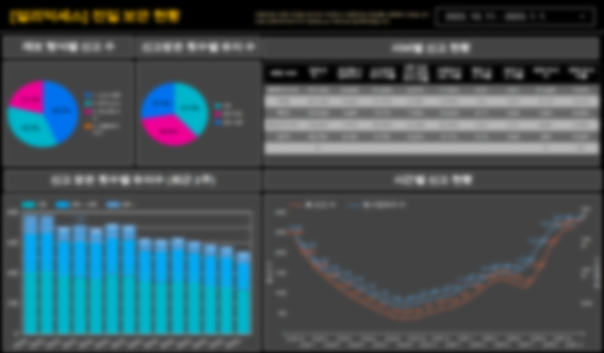

# 원더피플 자체 통계툴 개발

사용언어: BigQuery, PostgreSQL
업무포지션: 지표 선정, 쿼리튜닝, 통계툴 개발
투입기간: 2022/08/11 → 2022/12/28

## 👩‍🏫PROJECT 소개

---

🗓️ **작업기간** : 2022.08~2022.12

👨‍💻 **투입인원** : 3명

📒 **주요업무** 

- IP 현황에 대한 실시간/비실시간 모니터링
- 비용 절감 및 속도 향상을 위한 쿼리 튜닝
- 데이터 시각화 및 지표 수정을 통한 인사이트 도출

🌱 **스킬 및 사용툴**

`PostgreSQL` `BigQuery` `Looker Studio` `Grafana`  

## 🖌️Details

---

### 🔎 Looker Studio

- **주간 보안지표**
    - 설정 언어별 유저들의 MCU(Maximum Current User), DAU(Daily Active Users) 현황
- **일일 보안현황**
    - 국가별 신고 현황
    - 신고 한/받은 유저 수
    - 시간별 신고 현황
    - 제재 현황
- **이상지표 모니터링**
- **기술지표 유저 통계**
    - 총 게임수, FPS, PING, PC 사양 정보
- **CBT 통계 대시보드**
    - 유저 지표: 시간별 최대 동접, 리텐션
    - 유저 게임 데이터: 레벨, 클래스, 자원 등

### 🔥 그라파나

- **실시간 매칭**
    - 전체 & 국가별 매칭 주요 현황
    - 매칭 안정성 현황
- **실시간** **KPI**
    - 동시접속자수
    - 금일 접속자수, 금일 신규 유저수
    - 일/월 누적 매출
    - 리텐션
- **실시간 보안**
    - 전체 & 국가별 부안 주요 현황
    - 인게임 환경 현황
    - 신고 및 제재 현황
- **상위 관리자 전용 페이지**
    - 금일/월 누적 매출
    - 시간대/국가별 매출
    - 상품별 판매 현황
    - 국가별 동시접속자수

🔎**Looker Studio**

🔥 **그라파나**

