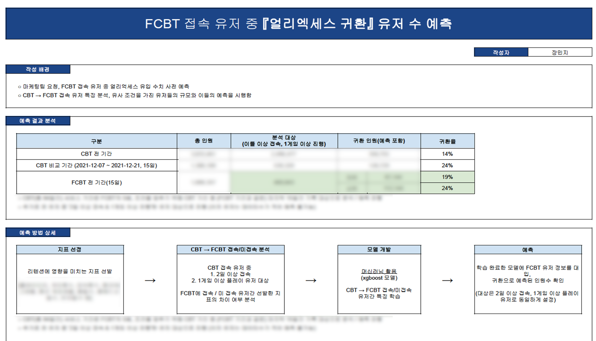

# [슈퍼피플] FCBT에 접속한 유저들 중 EA에 돌아올 가능성이 있는 유저 예측

- 사용언어: BigQuery, PostgreSQL, Python
- 업무포지션: EDA진행, 데이터 추출, 머신러닝모델 구축
- 투입기간: 2022/09/13 → 2022/09/27

## 👩‍🏫PROJECT 소개

🗓️ **작업기간** : 2022.09

👨‍💻 **투입인원** : 2명

📒 **주요업무** 

- EDA 분석
- 피처 및 머신러닝 모델 선택
- 결론 도출

🌱 **스킬 및 사용툴**

`PostgreSQL` `BigQuery` `Python`

## 🖌️Details

- EDA 분석
    - 특정 유저 그룹을 기준으로 지표별 EDA 진행(boxplot, describe 등)
- 피처 및 머신러닝 모델 선택
    - CBT 접속/미접속 유저, FCBT 접속/미접속 유저간 선발한 지표의 차이 여부 분석
    - accuracy와 F1값을 중심으로 K-Means, GMM, DBSCAN, randomforest, bagging, XGBoost 모델을 비교
    - 파라미터 조정에는 GridSearch 모델을 사용하였음
- 결론 도출
    - 피처수가 너무 적고 미접속 유저들에 대한 비중이 커서 결과가 정확하더라도 리콜이 높지 않음.
    - 피처를 다듬는 작업이 더 필요함
    - 오버샘플링과 같은 데이터 불균형 해소 방안을 좀더 알아보고 보완해야 함
    

